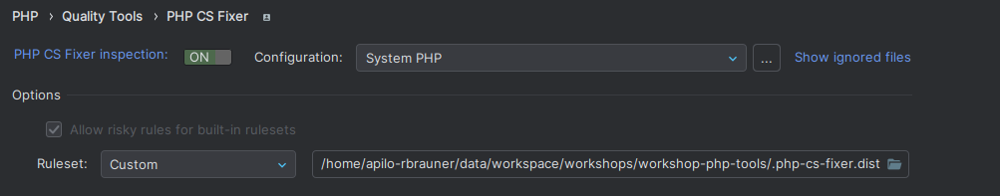
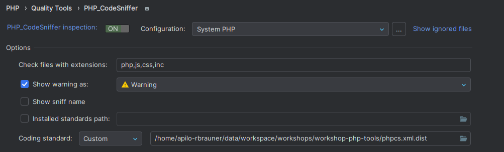
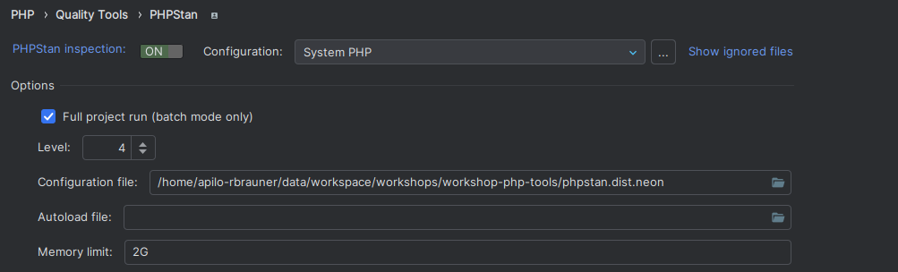
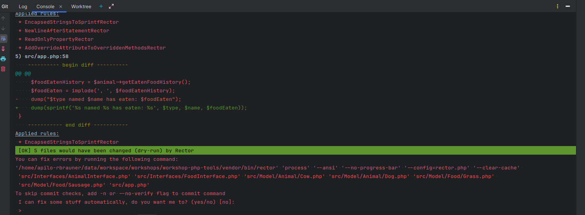

# Workshop - PHP tools

## Lista narzędzi

- Editorconfig
- PHP CS Fixer
- PHP Code Sniffer
- PHPStan
- Rector
- GrumPHP

## Narzędzia

### Editorconfig

#### Opis

Narzędzie do konfiguracji ogólnych/podstawowych ustawień formatowania plików takich jak:

- czy używać tabulatora czy spacji
- ile spacji na tab
- czy usuwać białe znaki na końcu lini
- czy tworzyć nową linie na końcu pliku

Narzędzie działa w trakcie pisania kodu. Jest stworzonych wiele wtyczek do każdego środowiska zaczynając od PHPStorm, VSCode poprzez Netbeans, Eclipse aż po Vim, Neovim (wszystkie opisane są https://editorconfig.org/#pre-installed).

Do działania należy jedynie stworzyć w projekcie plik `.editorconfig` oraz odpowiednio go skonfigurować.

#### Konfiguracja PHPStorm

Brak potrzeby, wbudowane.

#### Polecenia CLI

Brak, wszystko działa w trakcie zapisu pliku.

#### Linki

Strona internetowa: https://editorconfig.org

Link do Github'a: https://github.com/editorconfig/editorconfig

Link do dokumentacji: https://github.com/editorconfig/editorconfig/wiki

Link do ustawień: https://github.com/editorconfig/editorconfig/wiki/EditorConfig-Properties

### PHP CS Fixer

#### Opis

Narzędzie do sprawdzania i formatowania całego kodu projektu według zdefiniowanej konfiguracji. Pozwala na zdefiniowanie zarówno plików, które mają być formatowane, jak również zbiorów zasad oraz pojedyńczych regół. Dodatkowo wspiera formatowanie wg zasad `PSR`.

Aby korzystać w projekcie należy zainstalować paczkę:

```shell
composer require --dev friendsofphp/php-cs-fixer
```

oraz stworzyć i skonfigurować plik `.php-cs-fixer.dist.php`.

Wsparcie PHP: `php: ^7.4 || ^8.0`

#### Konfiguracja PHPStorm

https://www.jetbrains.com/help/phpstorm/using-php-cs-fixer.html

Należy skonfigurować narzędzie wg. https://www.jetbrains.com/help/phpstorm/using-php-cs-fixer.html#configure-tool-options.

Ustawić ruleset jako `Custom` i podać plik `.php-cs-fixer.dist.php`:



Oraz ustawić jako formatter: https://www.jetbrains.com/help/phpstorm/using-php-cs-fixer.html#fix-issues-with-code-reformat.

Warto ustawić inspekcje (https://www.jetbrains.com/help/phpstorm/using-php-cs-fixer.html#configure-tool-inspection-manually) oraz ustawić je jako error, dzięki temu od razu w PHPStorm będzie widać gdzie są błędy do zformatowania.

#### Polecenia CLI

- `php vendor/bin/php-cs-fixer` - wyświetlenie help
- `php vendor/bin/php-cs-fixer fix` - sformatowanie całego projektu
- `php vendor/bin/php-cs-fixer check --diff` - wyświetlenie jakie zmiany zostaną zrobione przy fix'ie

#### Linki

Strona internetowa: https://cs.symfony.com

Link do Github'a: https://github.com/PHP-CS-Fixer/PHP-CS-Fixer

Link do dokumentacji: https://cs.symfony.com/#documentation

Link do ustawień: https://cs.symfony.com/doc/rules/index.html / https://cs.symfony.com/doc/ruleSets/index.html

### PHP Code Sniffer

#### Opis

Kolejne narzędzie do sprawdzania kodu całego projektu, działa podobnie do PHP CS Fixer'a. Również pozwala na zdefiniowanie plików, które mają być formatowane, zbiorów zasad oraz pojedyńczych regół, a także wspiera `PSR`.

Aby korzystać w projekcie należy zainstalować paczkę:

```shell
composer require --dev squizlabs/php_codesniffer
```

oraz stworzyć i skonfigurować plik `phpcs.xml.dist`.

Wsparcie PHP: `php: >=5.4.0`

#### Konfiguracja PHPStorm

https://www.jetbrains.com/help/phpstorm/using-php-code-sniffer.html

Należy skonfigurować narzędzie wg. https://www.jetbrains.com/help/phpstorm/using-php-code-sniffer.html#configure-tool-options.

Ustawić coding standard jako `Custom` i podać plik `phpcs.xml.dist`:



Oraz ustawić jako formatter: https://www.jetbrains.com/help/phpstorm/using-php-code-sniffer.html#fix-issues-with-code-reformat.

Warto ustawić inspekcje (https://www.jetbrains.com/help/phpstorm/using-php-code-sniffer.html#enabling-tool-inspection) oraz ustawić je jako error, dzięki temu od razu w PHPStorm będzie widać gdzie są błędy do zformatowania.

#### Polecenia CLI

- `php vendor/bin/phpcs --help` - wyświetlenie help
- `php vendor/bin/phpcbf` - sformatowanie całego projektu
- `php vendor/bin/phpcs` - wyświetlenie jakie zmiany zostaną zrobione przy fix'ie

#### Linki

Strona internetowa: -

Link do Github'a: https://github.com/PHPCSStandards/PHP_CodeSniffer

Link do dokumentacji: https://github.com/PHPCSStandards/PHP_CodeSniffer/wiki

Link do ustawień: https://github.com/PHPCSStandards/PHP_CodeSniffer/wiki/Configuration-Options

### PHPStan

#### Opis

Narzędzie służące do statycznej analizy kodu. Pozwala na analizowanie kodu czy wszystko jest okej, tj. czy zmienne (w szczególności array) i ich typy odpowiadają akcjom, które na nich wykonujemy. Pozwala wcześniej wychwycić błedy i je poprawić. PHPStan wspiera używanie zwykłych opcji z php-doc'a (https://phpstan.org/writing-php-code/phpdocs-basics) + dodatkowo posiada jeszcze kilka swoich zdefiniowanych zaczynających się od `phpstan` np. `@phpstan-var`, które pozwalają ustawić typy dla PHPStan'a (przydatne przy okazji używania kilku narzędzi do statycznej analizy kodu takich jak PHPStan i Psalm).

PHPStan korzysta z wielu typów, posiada je zdefiniowane https://phpstan.org/writing-php-code/phpdoc-types. Jednymi z ważniejszych są tworzenie array'ów. Poniżej przykłady:

- `array<TaskInterface>` - tablica tasków o interfejsie `TaskInterface`
- `TaskInterface[]` - ekwiwalent do tego co wyżej
- `int<0, 100>` - tablica int'ów od 0-100
- `array<int, string>` - tablica, której kluczem jest `int`, a wartością `string`
- `array<int, object{abc: string, cba: int}>` - tablica, której kluczem jest `int`, a wartością obiekt z 2 propertisami, przykład zmiennej: `$a = [1 => ['abc' => 'lorem', 'cba' => 100], 2 => ['abc' => 'ipsum', 'cba' => -200]];`
- `non-empty-array<int>` - nie pusta tablica
- `list<string>` - lista elementów, ekwiwalent do `array<int, string>`
- oraz wiele innych

Dodatkowo PHPStan pozwala na używanie generyków https://phpstan.org/blog/generics-in-php-using-phpdocs.

Aby korzystać w projekcie należy zainstalować paczkę:

```shell
composer require --dev phpstan/phpstan
```

oraz stworzyć i skonfigurować plik `phpstan.dist.neon`.

Wsparcie PHP: `php: ^7.2|^8.0`

#### Konfiguracja PHPStorm

https://www.jetbrains.com/help/phpstorm/using-phpstan.html

Należy skonfigurować narzędzie wg. https://www.jetbrains.com/help/phpstorm/using-phpstan.html#configure-tool-options.

Ustawić configuration file `phpstan.dist.neon`:



Warto ustawić inspekcje (https://www.jetbrains.com/help/phpstorm/using-phpstan.html#configure-tool-inspection-manually) oraz ustawić je jako error, dzięki temu od razu w PHPStorm będzie widać gdzie są błędy do zformatowania.

#### Polecenia CLI

- `php vendor/bin/phpstan --help` - wyświetlenie help
- `php vendor/bin/phpstan` - wyświetlenie błędów

#### Linki

Strona internetowa: https://phpstan.org

Link do Github'a: https://github.com/phpstan/phpstan

Link do dokumentacji: https://phpstan.org/user-guide/getting-started

Link do ustawień: https://phpstan.org/config-reference

PHPDoc basics - https://phpstan.org/writing-php-code/phpdocs-basics

Typy - https://phpstan.org/writing-php-code/phpdoc-types

### Rector

#### Opis

Narzędzie często korzystane do podnoszenia wersji PHP/Symfony do nowszych, ale także do zwykłego formatowania plików. Jest ono potężniejsze niż PHP CS Fixer. Robi głębszą analizę kodu i poprawia go według zdefiniowanych zasad. Pozwala na zdefiniowanie zarówno plików, które mają być formatowane, jak również zbiorów zasad oraz pojedyńczych regół. Dodatkowo wspiera formatowanie wg zasad `PSR`.

Aby korzystać w projekcie należy zainstalować paczkę:

```shell
composer require --dev rector/rector
```

oraz stworzyć i skonfigurować plik `rector.php`.

Wsparcie PHP: `php: ^7.2|^8.0`

#### Konfiguracja PHPStorm

https://www.jetbrains.com/help/phpstorm/rector.html

Można dodać konfigurację do opcji Run, żeby móc uruchamiać z eksploratora https://www.jetbrains.com/help/phpstorm/rector.html#run-rector-configuration.

#### Polecenia CLI

- `php vendor/bin/rector --help` - wyświetlenie help
- `php vendor/bin/rector` - sformatowanie całego projektu
- `php vendor/bin/rector --dry-run` - wyświetlenie jakie zmiany zostaną zrobione przy fix'ie

#### Linki

Strona internetowa: https://getrector.com

Link do Github'a: https://github.com/rectorphp/rector

Link do dokumentacji: https://getrector.com/documentation

Link do ustawień: https://getrector.com/find-rule

### GrumPHP

#### Opis

Narzędzie tworzące git hook'a na commit'y i uruchamiający zdefiniowane task'i. Pozwala na uruchamianie wcześniej zdefiniowanych narzędzi (PHP CS Fixer, PHP CS, PHPStan, Rector) na plikach, które zostaną zcommitowane i blokujący commitowanie jeśli narzędzia nie przeszły. Pozwala to na utrzymywanie jakości kodu przy każdym commicie. Dodatkowo w opcjach można też ustawić nazwy branchy, nazwy commitów etc. jakie muszą być stosowane w projekcie.

#### Konfiguracja PHPStorm

Niestety nie ma wsparcia do PHPStorm. Zalecane jest używanie CLI do commitowania (`git add . && git commit -m "nazwa commita"`), ponieważ jeśli commit nie przejdzie to zostanie wyświetlone jakie zmiany trzeba zrobić + użytkownik zostanie zapytany czy grump ma samemu uruchomić fixy. Jeśli jednak ktoś chce użyć PHPStorm do commit'a to jest możliwość, ale w razie problemu z kodem, pojawi się okienko notyfikacji i trzba wejść w `Git -> Show git log` a następnie wybrać zakładkę `Terminal` i wtedy można zobaczyć logi co poszło nie tak w ostatnim commicie (wygląd jak z CLI):



Niestety w tej opcji nie mamy możliwości kliknięcia `y`, aby grump sam naprawił kod, dlatego polecam commitować przez CLI (nawet można dodać w PHPStorm do kolejki, a w CLI tylko `git commit -m "nazwa commitu"`).

#### Polecenia CLI

- `php vendor/bin/grumphp` - wyświetlenie help
- `php vendor/bin/grumphp run` - uruchomienie tasków
- `php vendor/bin/grumphp git:init` - włącza git hook'i
- `php vendor/bin/grumphp git:deinit` - UWAGA! wyłącza git hook'i, rób to tylko w momencie kiedy wiesz co robisz

#### Linki

Strona internetowa: -

Link do Github'a: https://github.com/phpro/grumphp

Link do dokumentacji: https://github.com/phpro/grumphp/tree/v2.x/doc

Link do ustawień: https://github.com/phpro/grumphp/blob/v2.x/doc/parameters.md / https://github.com/phpro/grumphp/blob/v2.x/doc/tasks.md
